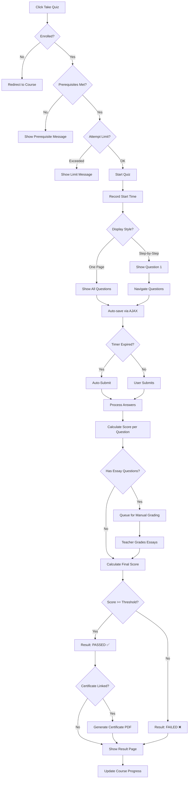

# Flow: Quiz Taking & Grading

```mermaid
flowchart TD
    A[Click Take Quiz] --> B{Enrolled?}
    B -->|No| C[Redirect to Course]
    B -->|Yes| D{Prerequisites Met?}
    D -->|No| E[Show Prerequisite Message]
    D -->|Yes| F{Attempt Limit?}
    F -->|Exceeded| G[Show Limit Message]
    F -->|OK| H[Start Quiz]
    H --> I[Record Start Time]
    I --> J{Display Style?}
    J -->|One Page| K[Show All Questions]
    J -->|Step-by-Step| L[Show Question 1]
    K --> M[Auto-save via AJAX]
    L --> N[Navigate Questions]
    N --> M
    M --> O{Timer Expired?}
    O -->|Yes| P[Auto-Submit]
    O -->|No| Q[User Submits]
    P & Q --> R[Process Answers]
    R --> S[Calculate Score per Question]
    S --> T{Has Essay Questions?}
    T -->|Yes| U[Queue for Manual Grading]
    T -->|No| V[Calculate Final Score]
    U --> W[Teacher Grades Essays]
    W --> V
    V --> X{Score >= Threshold?}
    X -->|Yes| Y[Result: PASSED ✅]
    X -->|No| Z[Result: FAILED ❌]
    Y --> AA{Certificate Linked?}
    AA -->|Yes| AB[Generate Certificate PDF]
    AA -->|No| AC[Show Result Page]
    AB --> AC
    Z --> AC
    AC --> AD[Update Course Progress]
```
