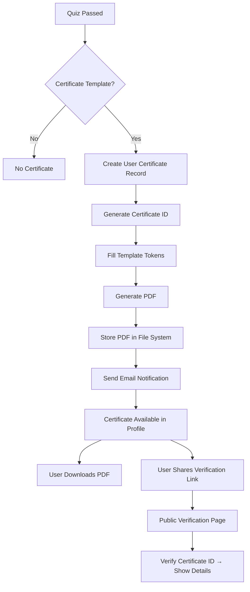

# Flow: Certificate Issuance

```mermaid
flowchart TD
    A[Quiz Passed] --> B{Certificate Template?}
    B -->|No| C[No Certificate]
    B -->|Yes| D[Create User Certificate Record]
    D --> E[Generate Certificate ID]
    E --> F[Fill Template Tokens]
    F --> G[Generate PDF]
    G --> H[Store PDF in File System]
    H --> I[Send Email Notification]
    I --> J[Certificate Available in Profile]
    J --> K[User Downloads PDF]
    J --> L[User Shares Verification Link]
    L --> M[Public Verification Page]
    M --> N[Verify Certificate ID → Show Details]
```
