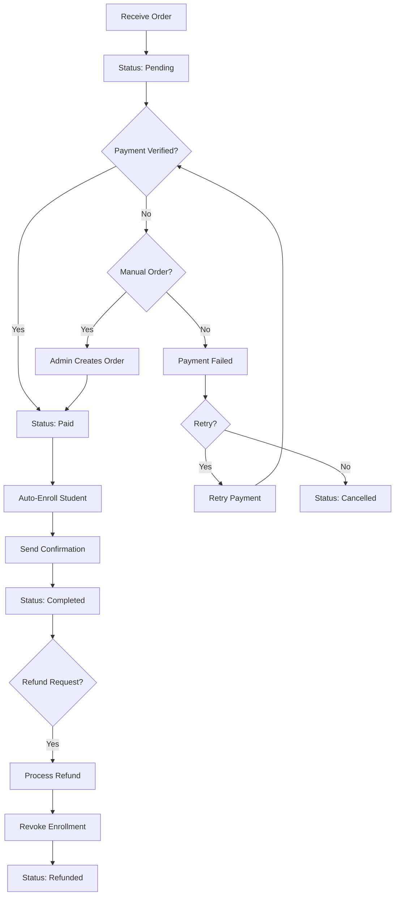

# Flow: Order Management

```mermaid
flowchart TD
    A[Receive Order] --> B[Status: Pending]
    B --> C{Payment Verified?}
    C -->|Yes| D[Status: Paid]
    D --> E[Auto-Enroll Student]
    E --> F[Send Confirmation]
    F --> G[Status: Completed]
    C -->|No| H{Manual Order?}
    H -->|Yes| I[Admin Creates Order]
    I --> D
    H -->|No| J[Payment Failed]
    J --> K{Retry?}
    K -->|Yes| L[Retry Payment]
    L --> C
    K -->|No| M[Status: Cancelled]
    
    G --> N{Refund Request?}
    N -->|Yes| O[Process Refund]
    O --> P[Revoke Enrollment]
    P --> Q[Status: Refunded]
```
